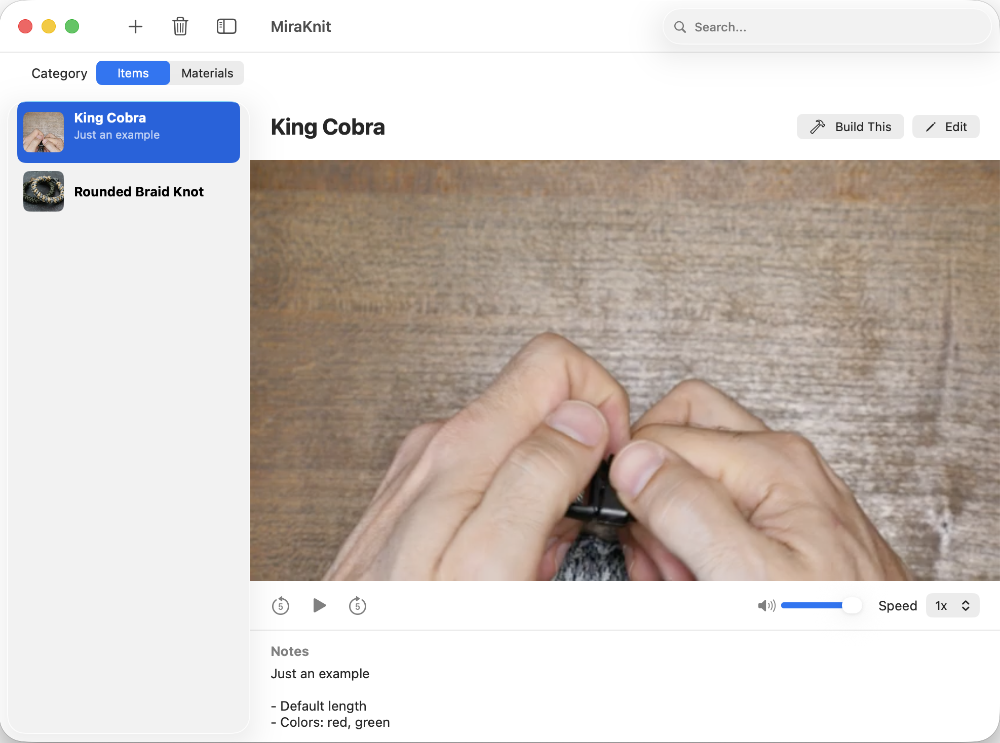
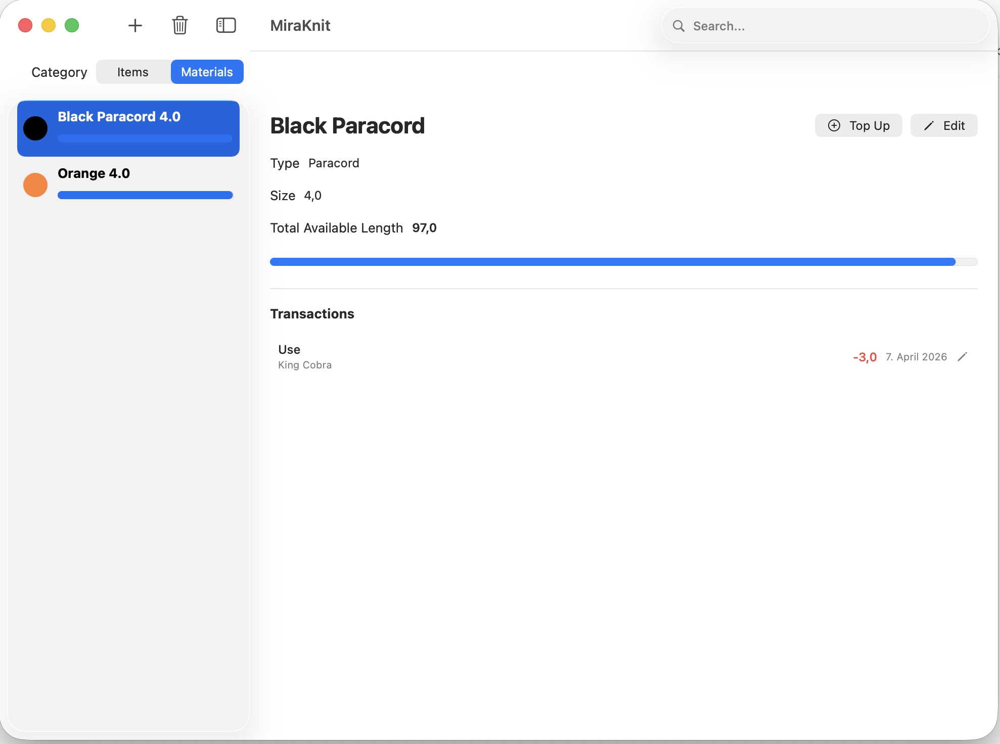

# MiraKnit

MiraKnit is a small MacOS application for managing your tutorials and materials. It was developed to help my wife when creating paracord bracelets.
The idea is that you can have all your available materials and they quantities/lengths and on the other hand have your instuctions how to create 
the items. So you can then just click "Build This" and enter the lengths of the materials that you have used.

The application was developed on MacOS Tahoe, so I have not tested it on older MacOS versions or Intel based Macs.

## Features

- Manage YT tutorial videos - stored locally in the application folder (usually `~/Library/Application Support/MiraKnit/`)
- Video Player, that can slow down playback
- Add notes to your local videos videos
- Material management
- Material Transactions - how much you have used per item, and topping up (e.g. when you boy more from the same color)

## Screenshots

## TODO

This will be updated as we go. Basic functionality is done, but there is a lot of room for improvement.

- [ ] Installable with homebrew
- [ ] Test on older MacOS versions?

## Licesnse

MIT License - see [LICENSE](LICENSE)

## Contributions

Contributions are very much welcome.

## Special Thanks

- [Kenny Wang](https://github.com/jaywcjlove) for the ColorSelector package
- [yt-dlp](https://github.com/yt-dlp/yt-dlp) - without it video would be difficult :smiley: